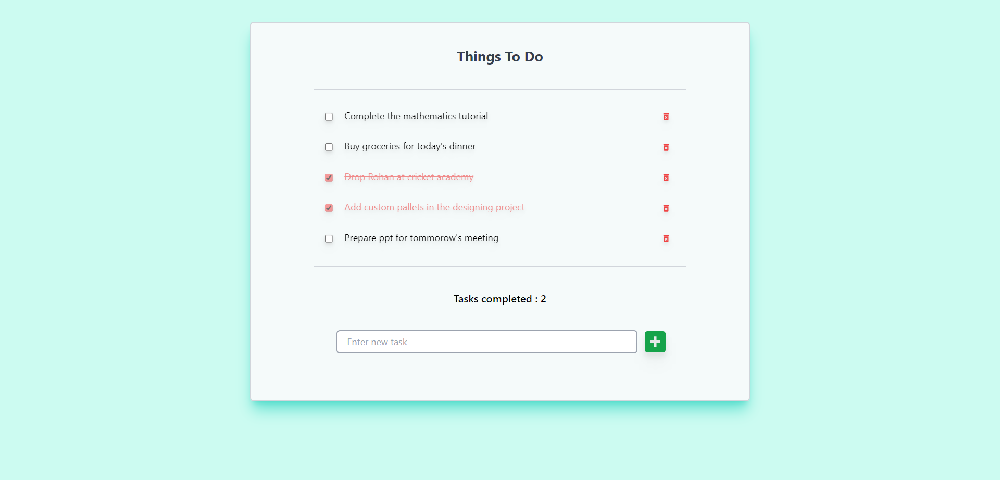
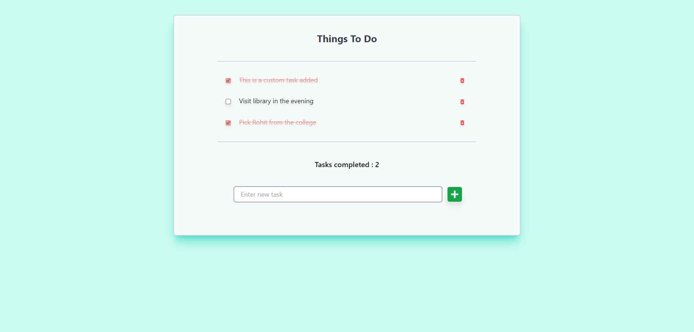
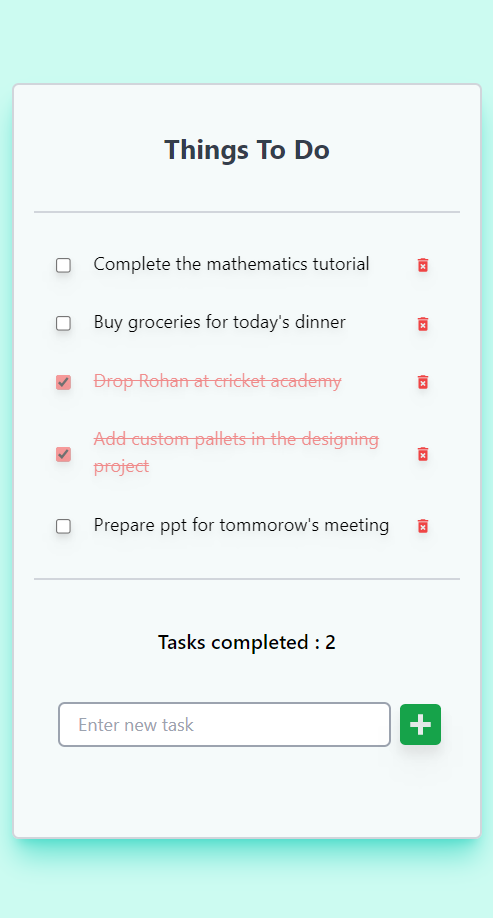
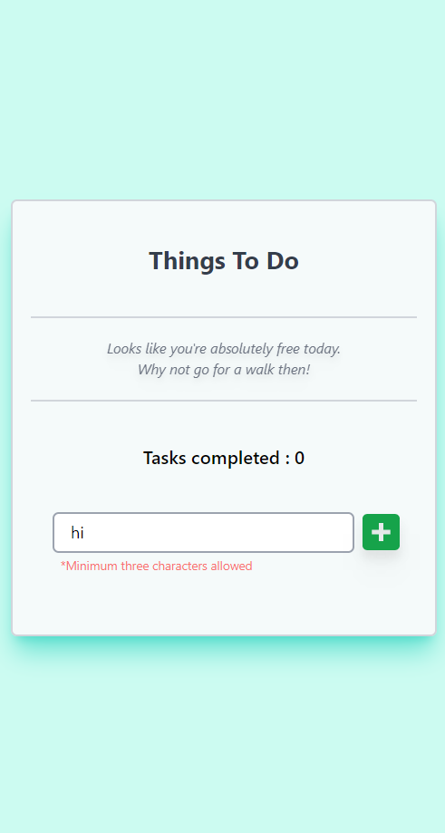

#  Things To Do

#### A responsive web application developed with React.js to add day to day tasks and keep a check on them. Initially a sample Api Fetch the tasks which can be deleted.

## Tech Stack
 React.Js, TailwindCss

## Features

Current Features:
1. Add custom daily tasks
2. Mark the completed task checked by using checkbox.
3. Keep a count of completed tasks.
4. Delete a perticular task.
5. Check if input is too small
6. Responsiveness

Upcoming features:
1. Search box to find a perticular task
2. Add task on pressing the enter key
3. Delete all the completed task with a sigle click
4. Edit a perticular task.

## Screenshots

### Desktop

Landing Page             |  Custom Tasks               
:-------------------------:|:-------------------------:
  |   

### Smartphone

Landing Page             |  No Task               
:-------------------------:|:-------------------------:
  |   

## Installation

**Things To Do** requires [Node.js](https://nodejs.org/) to run.
Install the dependencies and devDependencies and start the server.

#### **_Developed by Himanshu Singh_**
